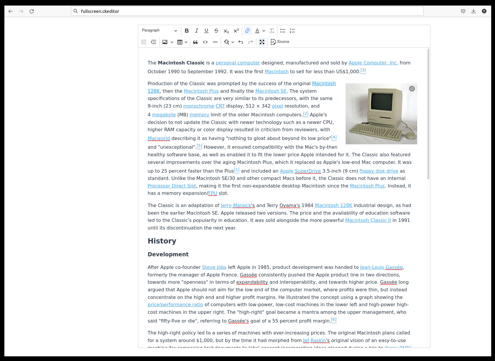
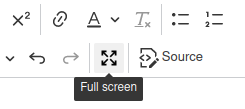

# CKEditor 5 full screen plugin



<p align="center">
    
</p>

Icon thanks to [css.gg](https://github.com/astrit/css.gg).

## Description

This plugin provides a full screen mode for ckeditor 5. The plugin adds a button to the editor toolbar which can be used to toggle between the normal ckeditor and the full screen mode. To exit the full screen mode, it is also possible to press escape or click anywhere in the background (See [configuration](#configuration)).

## Installation

Via npm:

```bash
npm i ckeditor5-full-screen
```

### Add the plugin to ckeditor:

If using a predefined build:

```js
import FullScreen from "ckeditor5-full-screen/src/fullscreen";

Editor.builtinPlugins = [
  // ...
  FullScreen,
];

Editor.defaultConfig = {
  toolbar: {
    items: [
      // ...
      "fullscreen", // Add the toolbar button
    ],
  },
};
```

If building from source:

```js
import FullScreen from "ckeditor5-full-screen/src/fullscreen";

Editor.create(element, {
  plugins: [FullScreen],
  toolbar: ["fullscreen"],
})
  .then((editor) => {
    // ...
  })
  .catch((error) => {
    // ...
  });
```

More information about installing plugins can be found in the official [documentation](https://ckeditor.com/docs/ckeditor5/latest/installation/getting-started/installing-plugins.html
).

## Configuration

| Name                       | Default value | Description                                                                            |
| -------------------------- | ------------- | -------------------------------------------------------------------------------------- |
| `fullscreen.closeOnEscape` | `true`        | If set to `true`, exits the full screen mode when escape is pressed.                   |
| `fullscreen.closeOnClick`  | `true`        | If set to `true`, exits the full screen mode when clicking anywhere in the background. |

### Example

```js
Editor.defaultConfig = {
  // ...
  fullscreen: {
    closeOnEscape: true,
    closeOnClick: false,
  },
};
```

```js
Editor.create(element, {
  // ...
  fullscreen: {
    closeOnEscape: true,
    closeOnClick: false,
  },
});
```

## Development

Ignore this if you just want to use this package.

If you want to run ckeditor locally using e.g. https://github.com/indico/ckeditor,
you can install this package directly:

`npm install $(npm pack /path/to/the/package | tail -1)`

Just using `npm install /path/to/the/package` doesn't work because npm symlinks the package instead of copying it. This will cause duplicated packages when bundling the editor with webpack (this [error](https://ckeditor.com/docs/ckeditor5/latest/support/error-codes.html#error-ckeditor-duplicated-modules)). The fix is to create a zipped package with `npm pack` first and installing that one instead.

Useful SO links:

- https://stackoverflow.com/a/53215430
- https://stackoverflow.com/a/45016447
